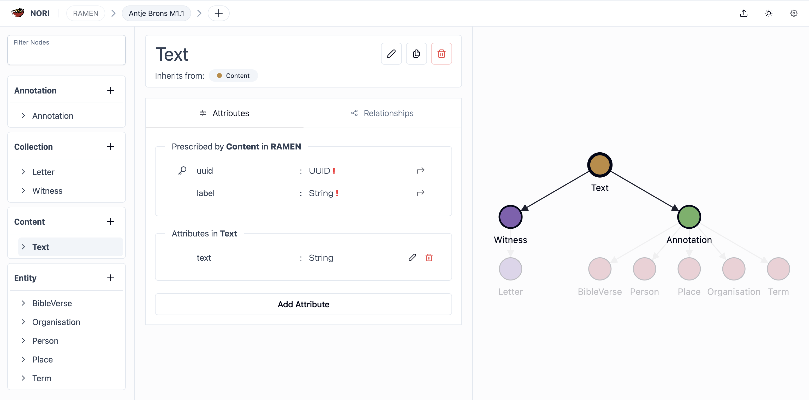
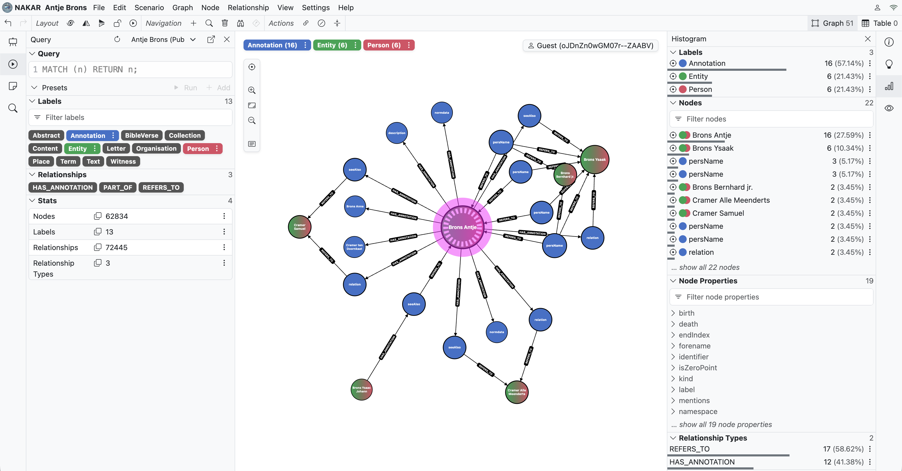

# Digitale Methoden und Umsetzung der Edition

Die digitale Edition des Briefwechsels von Antje Brons wurde zu Projektbeginn zunächst in der XML-basierten Editionsumgebung <u>[ediarum](https://www.ediarum.org/)</u> erfasst, die auf <u>[eXist-db](https://exist-db.org/)</u> und dem XML-Editor <u>[oXygen](https://www.oxygenxml.com/)</u> aufbaut. Im weiteren Projektverlauf erfolgte jedoch ein bewusster Wechsel in eine graphbasierte Editionsarchitektur. Die <u>[TEI](https://tei-c.org/)</u>-Semantik bleibt dabei als editorische Grundlage erhalten, wird nun aber nicht mehr primär in XML-Hierarchien serialisiert, sondern direkt in einem Graphmodell umgesetzt.

Dieser Wechsel ermöglicht es, textuelle Strukturen, Annotationen, Entitäten und Verweise als explizite Beziehungen zu modellieren. Cross References zwischen Briefen, Personen, Orten, Körperschaften, Themen, Kommentaren, Quellen und Literaturangaben müssen dadurch nicht mehr aus XML-Attributen oder dokumentgebundenen Identifiern rekonstruiert werden, sondern liegen als Knoten und Kanten unmittelbar im Graphen vor. Die Edition arbeitet damit direkt auf graphbasierten Forschungsdaten und nutzt die Graphdatenbank <u>[Neo4j](https://neo4j.com/)</u> als zentrale Datenhaltung.

Die konzeptionelle Grundlage bildet <u>[RAMEN](https://ramen-schema.org)</u> – das Reusable Abstraction Model for Editorial Needs. RAMEN stellt ein projektübergreifend nutzbares Domänenmodell für digitale Editionen bereit und beschreibt grundlegende editorische Konzepte wie Sammlungen, Inhalte, Entitäten und Annotationen sowie deren Beziehungen. Für den Briefwechsel von Antje Brons wird RAMEN genutzt, um Briefe, Bilder, Textfassungen, Registereinträge, Annotationen und semantische Verweise konsistent miteinander zu verbinden. Für die Serialisierung von Texten wird auf der Methodik <u>[Applied Text as Graph (ATAG)](https://journals.openedition.org/jtei/6027)</u> aufgebaut, bei der Text nicht als XML-Hierarchie, sondern als graphbasierte Struktur modelliert wird.

**Die technische Umsetzung erfolgt mit mehreren <u>[digitalen Werkzeugen](https://github.com/RAMEN-Suite)</u>:**

- <u>[NORI](https://github.com/RAMEN-Suite/NORI)</u> zur Modellierung und Verfeinerung projektspezifischer Strukturen auf Basis von RAMEN.
- <u>[CAMI](https://github.com/RAMEN-Suite/CAMI)</u> zur editorischen Datenerfassung und Annotation direkt auf graphbasierten Text-, Bild- und Annotationsdaten.
- <u>[AWEN](https://github.com/RAMEN-Suite/AWEN)</u> zur Verknüpfung, Pflege und Anreicherung von Entitäten
- <u>[Neo4j](https://neo4j.com/)</u> zur Speicherung, Abfrage und Auswertung der graphbasierten Editionsdaten

Ergänzend werden Registerdaten mit Normdatenressourcen wie GND, GeoNames und Wikidata verknüpft; Literatur- und Quellenangaben werden über Zotero verwaltet.

Für die explorative Analyse der im Graph gespeicherten Daten wird zusätzlich <u>[NAKAR](https://go.thm.de/nakar)</u> eingesetzt. NAKAR ermöglicht die visuelle Erschließung komplexer Netzwerkdaten ohne Programmieraufwand. Über szenariobasierte Navigation, interaktive Visualisierungen und Drilldown-Funktionen können Korrespondenzbeziehungen, Personen- und Ortsnetzwerke sowie thematische Zusammenhänge im Datenbestand untersucht werden.
